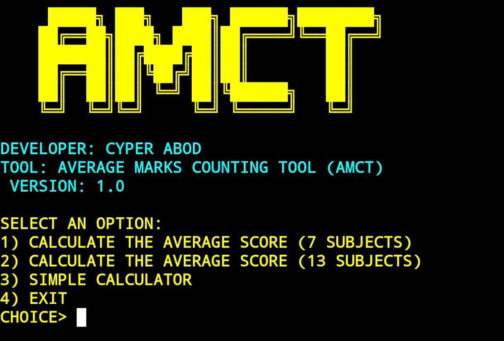

# AMCT
# AMCT (Average Marks Counting Tool)

AMCT is a colorful Python tool that helps students and teachers quickly calculate average scores and perform basic math operations.  

## 🔧 Features
- Calculate average score for 7 subjects (Iraqi style)
- Calculate average score for 13 subjects
- Simple built-in calculator (supports + - * / % ** and parentheses)
- ASCII art logo & colorful output
- Clean exit message when pressing CTRL + C

## 📥 Installation & Usage

Clone this repository and run the tool:

`bash
git clone https://github.com/CYPER-ABOD/AMCT.git
cd AMCT
python amct.py
